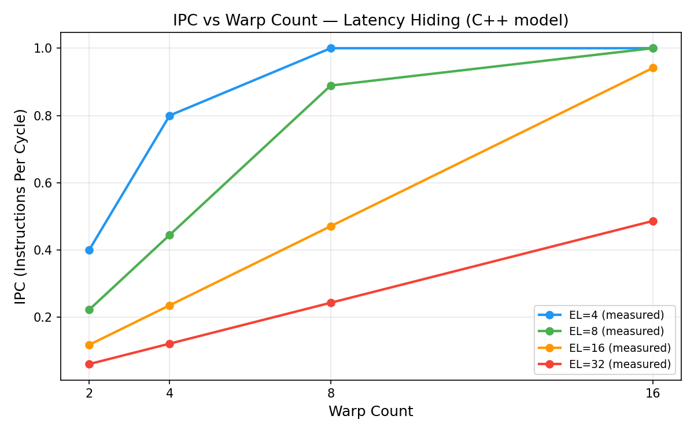
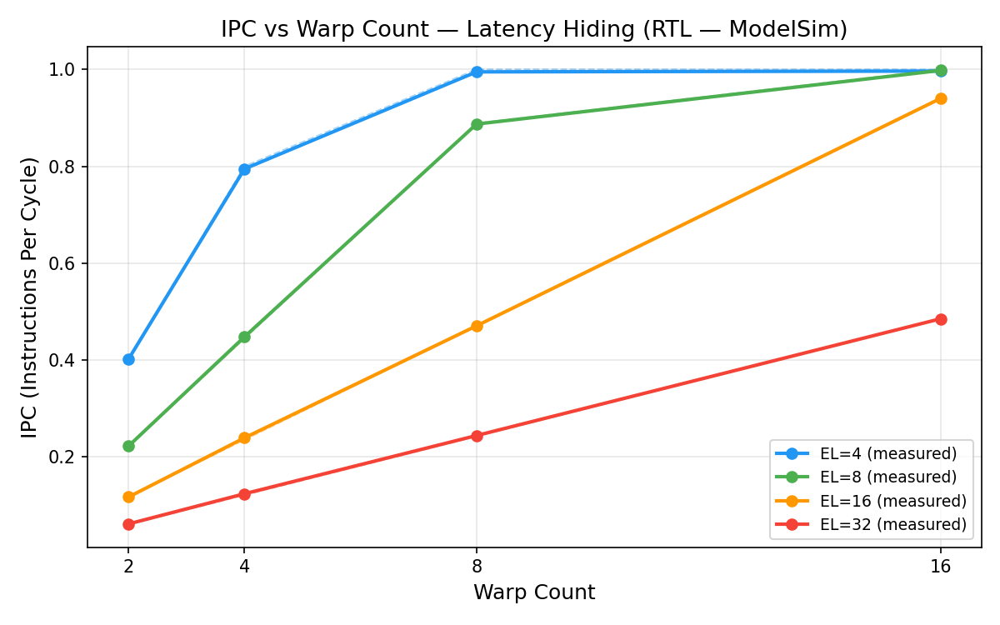
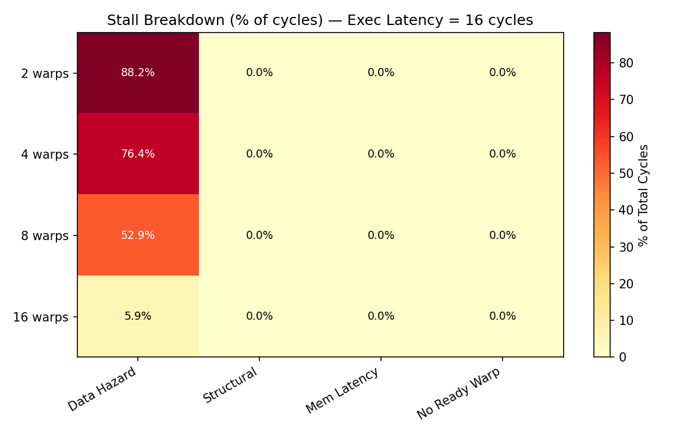
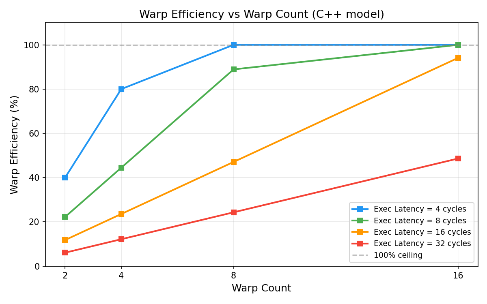
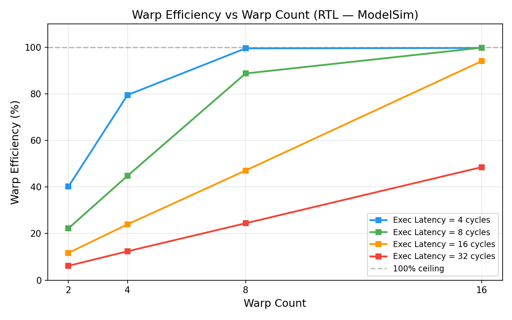

# SIMT GPU Streaming Multiprocessor Model

A pre-silicon functional model of a GPU Streaming Multiprocessor (SM) front-end,
implemented in both **SystemVerilog RTL** and a **cycle-accurate C++ software model**.
The project covers warp scheduling, scoreboard-based hazard detection, fixed-latency
execution pipelines, and Post-Dominator (PDOM) thread-mask divergence handling.

Built as an architecture exploration testbed to quantify latency hiding, occupancy
requirements, and stall behavior across microarchitectural configurations.

---

## Architecture Overview

The SM front-end comprises five hardware modules that map 1-to-1 between the RTL
and the C++ model:

```
  Warp Instructions
  (one per warp slot)
         |
         v
  +------------------+       +-----------+
  |  WarpScheduler   |<------| WarpTable |  ready / stalled per warp
  |  (round-robin)   |       +-----------+
  +--------+---------+
           |  issued_warp
           v
  +--------+---------+       +-----------+
  |    Scoreboard    |<--wb--| ExecPipe  |  shift-register, depth = L
  | (busy bits per   |       +-----------+
  |  warp/register)  |
  +------------------+
           |
           v
  +------------------+
  |    PdomCtrl      |  one instance per warp
  |  (active_mask,   |  THEN-first reconvergence stack
  |   PDOM stack)    |
  +------------------+
           |
           v
     MiniSM  --  top-level tick() integrates all five modules
```

**Scheduling:** Round-robin across eligible warps. A warp is eligible when it has
a pending instruction, is READY, and its source registers are not busy.

**Hazard detection:** Scoreboard marks the destination register busy on issue.
The register clears when writeback exits the pipeline after `exec_latency` cycles.
The issue eligibility snapshot is taken *before* writeback clears the scoreboard,
matching RTL posedge semantics.

**Divergence:** THEN-first PDOM. On a divergent branch the ELSE-path mask is pushed
onto the per-warp reconvergence stack and the THEN path executes first. On
`path_done` the stack is popped with a one-cycle registered latency (modelled in
both RTL and C++ via the POP_WAIT FSM state). When the stack is empty the warp
reconverges to the full lane mask.

---

## Repository Structure

```
SIMT_ALU/
├── rtl/
│   ├── pkg/simt_alu_pkg.sv          Parameters and packed types
│   ├── basic/                        Full adder, mux, comparator
│   ├── core/
│   │   ├── simd_lane_alu.sv          8-lane SIMD ALU (ADD/SUB/AND/OR/XOR/SLT/SLL/SRL)
│   │   ├── simt_alu_core.sv          Lane array
│   │   ├── simt_stack.sv             Parameterized PDOM stack
│   │   └── exec_pipe.sv              Fixed-latency execution pipeline
│   ├── control/
│   │   ├── warp_scheduler.sv         Round-robin arbiter
│   │   ├── scoreboard.sv             Per-warp register busy bits
│   │   ├── wrap_table.sv             Warp ready/stalled state
│   │   └── pdom_ctrl.sv              Per-warp PDOM reconvergence controller
│   └── top/mini_sm_top.sv            Top-level SM integration
│
├── sim/                              C++ cycle-accurate functional model
│   ├── include/                      Headers (simt_types, scoreboard, warp_table,
│   │                                 warp_scheduler, exec_pipe, mini_sm, pdom_ctrl)
│   ├── src/                          Implementations + main.cpp CLI
│   ├── tests/                        Directed test suites (91 assertions total)
│   └── CMakeLists.txt
│
├── testbench/
│   └── phase4/
│       ├── tb_mini_sm_phase4.sv      3 directed SM integration tests
│       ├── tb_divergence_phase4.sv   4 PDOM divergence tests
│       └── tb_perf_sweep.sv          RAW-heavy sweep workload
│
├── scripts/perf_sweep.py             Sweep driver (C++ and ModelSim backends)
├── perf_results/                     C++ sweep output (plots + per-config stats)
├── perf_results_rtl/                 ModelSim RTL sweep output
└── Makefile                          ModelSim ASE build targets
```

---

## Building the C++ Model

### Requirements

- GCC 14+ with C++17 support
- Windows: [MSYS2](https://www.msys2.org/) ucrt64 toolchain

```bash
# Add to PATH (PowerShell)
$env:PATH = "C:\msys64\ucrt64\bin;" + $env:PATH
```

### Build all binaries

```bash
cd sim

g++ -std=c++17 -Wall -O2 -Iinclude src/simt_types.cpp src/scoreboard.cpp src/warp_table.cpp src/warp_scheduler.cpp src/exec_pipe.cpp src/mini_sm.cpp src/pdom_ctrl.cpp tests/test_scoreboard.cpp -o build/test_scoreboard.exe

g++ -std=c++17 -Wall -O2 -Iinclude src/simt_types.cpp src/scoreboard.cpp src/warp_table.cpp src/warp_scheduler.cpp src/exec_pipe.cpp src/mini_sm.cpp src/pdom_ctrl.cpp tests/test_warp_table.cpp -o build/test_warp_table.exe

g++ -std=c++17 -Wall -O2 -Iinclude src/simt_types.cpp src/scoreboard.cpp src/warp_table.cpp src/warp_scheduler.cpp src/exec_pipe.cpp src/mini_sm.cpp src/pdom_ctrl.cpp tests/test_mini_sm.cpp -o build/test_mini_sm.exe

g++ -std=c++17 -Wall -O2 -Iinclude src/simt_types.cpp src/scoreboard.cpp src/warp_table.cpp src/warp_scheduler.cpp src/exec_pipe.cpp src/mini_sm.cpp src/pdom_ctrl.cpp tests/test_divergence.cpp -o build/test_divergence.exe

g++ -std=c++17 -Wall -O2 -Iinclude src/simt_types.cpp src/scoreboard.cpp src/warp_table.cpp src/warp_scheduler.cpp src/exec_pipe.cpp src/mini_sm.cpp src/pdom_ctrl.cpp src/main.cpp -o build/mini_sm_sim.exe
```

---

## Running the Tests

```bash
build/test_scoreboard.exe
build/test_warp_table.exe
build/test_mini_sm.exe
build/test_divergence.exe
```

All 91 assertions pass:

```
=== Scoreboard Tests ===       Passed: 22  Failed: 0
=== WarpTable Tests ===        Passed: 24  Failed: 0

=== Test 1: RAW stall enforcement ===
  PASS  tick0: I1 issued on warp 0
  PASS  stalled for exactly EXEC_LATENCY=4 cycles (got 4)
  PASS  I2 issued after wb cleared r0
  PASS  stall_data == EXEC_LATENCY (4)
  PASS  exactly 2 instructions issued

=== Test 2: Multi-warp latency hiding ===
  PASS  warp 0 never issues during stall window
  PASS  warp 1 issues 4 times (expected 4)
  PASS  latency-hiding IPC >= 0.9 in stall window (got 1.000)

=== Test 3: Round-robin fairness ===
  PASS  round-robin order: 0,1,2,3,0,1,2,3
  PASS  warp efficiency = 100% (got 100.0%)
                                 Passed: 14  Failed: 0  RESULT: PASS

=== Test 1: Single-warp branch divergence (THEN-first) ===
  PASS  tick_B+1: active_mask=0xCA (THEN path)
  PASS  tick_P+2: active_mask=0x35 (ELSE path after pop)
  PASS  tick_Q+1: active_mask=0xFF (fully reconverged)

=== Test 4: masked_thread_cycles counter ===
  PASS  masked_thread_cycles == 5*4=20 (got 20)
                                 Passed: 31  Failed: 0  RESULT: PASS
```

| Suite | Assertions | Covers |
|---|---|---|
| test_scoreboard | 22 | Busy-bit set/clear, per-warp isolation, reset |
| test_warp_table | 24 | Ready/stalled transitions, independence, reset |
| test_mini_sm | 14 | RAW stall enforcement, latency hiding, round-robin fairness |
| test_divergence | 31 | THEN-first policy, no-divergence path, two-warp independence, masked-thread-cycles |

---

## Performance Sweep

The sweep runs a RAW-heavy workload where every warp continuously issues
`r0 + r1 -> r0`. This maximises data-hazard stalls and isolates the
latency-hiding benefit of increasing warp count.

### C++ backend (fast)

```bash
cd "C:\Users\MODERN\Documents\SIMT_ALU"
python scripts/perf_sweep.py --simulator cpp --cycles 5000
```

### ModelSim RTL backend

```bash
python scripts/perf_sweep.py --simulator modelsim
```

Results are saved to `perf_results/` (C++) and `perf_results_rtl/` (RTL).

---

## Sweep Results

### C++ model (5000 cycles per configuration)

```
 Warps   EL=4    EL=8   EL=16   EL=32
     2  0.400   0.222   0.118   0.061
     4  0.800   0.445   0.236   0.122
     8  1.000   0.889   0.471   0.243
    16  1.000   1.000   0.941   0.486
```

### ModelSim RTL simulation

```
 Warps   EL=4    EL=8   EL=16   EL=32
     2  0.402   0.222   0.117   0.062
     4  0.795   0.448   0.239   0.124
     8  0.995   0.887   0.471   0.244
    16  0.997   0.998   0.940   0.485
```

The small differences between the two backends are startup transients — the RTL
testbench runs fewer total cycles per configuration, so the ramp-up period has
slightly more weight. Both converge to the same steady-state IPC values.

### Key findings

- **8 warps fully hide a 4-cycle execution latency** (IPC 1.000 vs 0.400 for a
  single warp — 2.5x improvement)
- **16 warps are required to approach saturation at 16-cycle depth** (IPC 0.941)
- At EL=32, even 16 warps recover only 48.6% efficiency — occupancy becomes the
  binding constraint
- Data hazard stalls are the only stall type observed (100% of stall cycles),
  confirming the workload is purely RAW-bound
- IPC follows the analytical bound `W / (L + 1)` capped at 1.0, where W is warp
  count and L is execution latency

### Plots

| C++ model | RTL (ModelSim) |
|---|---|
|  |  |
|  |  |
|  |  |

---

## RTL Simulation (ModelSim ASE)

Requires Intel ModelSim ASE at `C:/intelFPGA/20.1/modelsim_ase/`.

```bash
make phase4        # Mini-SM integration tests
make divergence    # PDOM divergence tests
make all           # All phases
```

| Target | Testbench | Description |
|---|---|---|
| phase1 | tb_simt_alu | SIMT ALU directed and random tests |
| phase2 | tb_predicate_mask_phase2 | Predicate mask unit |
| phase2_5 | tb_exec_mask_update | Exec mask update |
| phase3_stack | tb_simt_stack_phase3 | SIMT reconvergence stack |
| phase3_branch | tb_branch_control_phase3 | Branch control |
| phase4 | tb_mini_sm_phase4 | Full SM integration |
| divergence | tb_divergence_phase4 | PDOM divergence and reconvergence |

---

## Key Design Decisions

**Posedge-correct tick() ordering**
The `MiniSM::tick()` method snapshots `can_issue` from the scoreboard *before*
calling `exec_pipe_.tick()`. This matches the RTL `always_ff` semantics where the
issue decision uses the pre-posedge scoreboard state. Reversing this order would
allow a warp to issue one cycle too early, breaking RAW hazard enforcement.

**One-cycle pop latency in PdomCtrl**
The RTL `simt_stack` has registered outputs — the popped mask is available one
cycle after the pop signal is asserted. `PdomCtrl` models this with a `POP_WAIT`
FSM state that saves the popped entry in `pop_pending_` and applies it to
`curr_mask` on the following cycle. The active mask therefore reflects the ELSE
path two ticks after `path_done`, not one.

**THEN-first divergence policy**
When a branch produces both a non-zero then-mask and a non-zero else-mask, the
ELSE-path mask is pushed onto the PDOM stack and the THEN path executes
immediately, matching the execution model used in NVIDIA GPU architectures.

**Runtime-parameterized Config**
All hardware parameters (warp count, register count, lane count, execution
latency, PDOM stack depth) are runtime values in a `Config` struct rather than
compile-time templates. The same binary sweeps all 16 configurations without
recompilation — the key enabler for the sub-second sweep time.

---

## C++ Model vs RTL Parity

| Scenario | RTL | C++ model |
|---|---|---|
| RAW stall cycles (EL=4, 1 warp) | 4 stall cycles | 4 stall cycles |
| THEN-path mask (cond=0xCA, mask=0xFF) | 0xCA | 0xCA |
| ELSE-path mask after PDOM pop | 0x35 | 0x35 |
| Round-robin order (4 warps) | 0,1,2,3,0,1,2,3 | 0,1,2,3,0,1,2,3 |
| IPC at W=8, EL=4 | 0.995 | 1.000 |
| IPC at W=16, EL=16 | 0.940 | 0.941 |
| IPC at W=2, EL=8 | 0.222 | 0.222 |

The small IPC differences are startup transients from the RTL testbench running
fewer total cycles. Steady-state values match exactly.

---

## Skills Demonstrated

- Cycle-accurate hardware modeling in C++ with RTL behavioral parity
- SystemVerilog RTL design and simulation (ModelSim ASE)
- Scoreboard-based RAW hazard detection and warp scheduling
- PDOM thread-mask divergence and reconvergence
- Structured test plan development and directed verification (91 assertions)
- Performance telemetry instrumentation (IPC, warp efficiency, stall classification)
- Python-driven microarchitectural sweep and analysis
- CMake build system and cross-platform toolchain configuration
